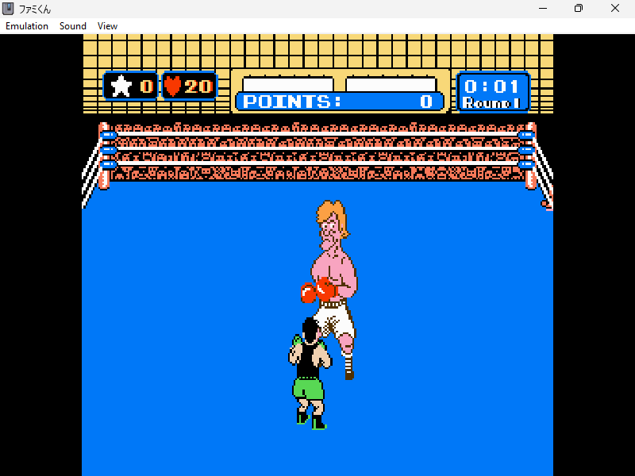
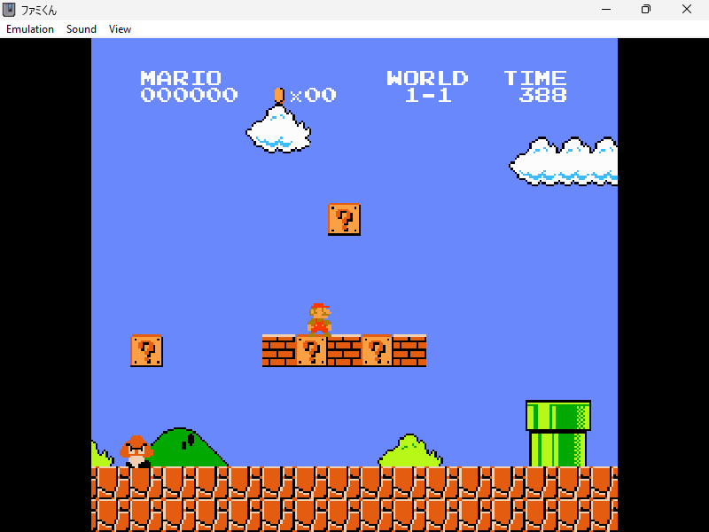
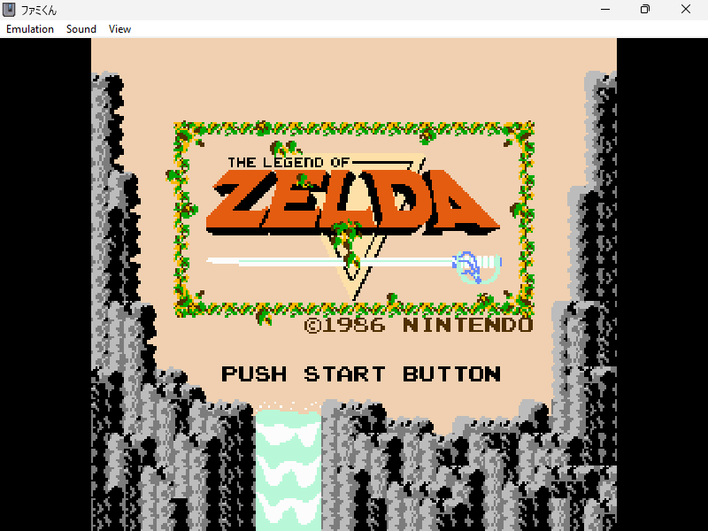
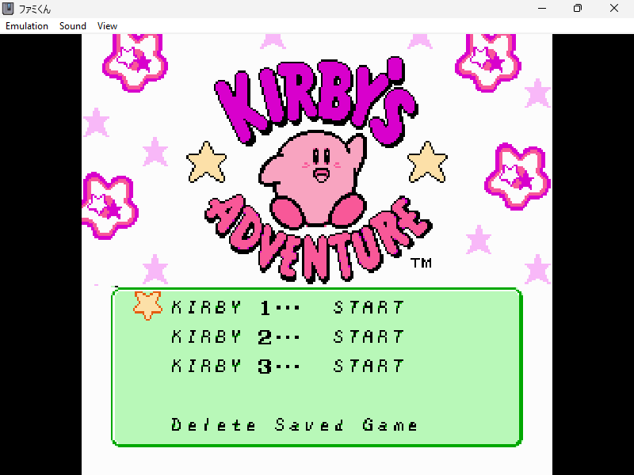

# Famikun (ファミくん)

## General Information

Famikun is a simple Famicom Emulator. It has support for Zapper.

## How to use

From command line executes:
`` 
famikun.exe <rom path>
``
Optionally, you can just drag and drop the rom file to ```famikun.exe``` file.

## Commands

| PC | Famicom |
|----------|----------|
| Z   | B     |
| X    | A     |
| ARROW KEYS   | DPAD     |
| RIGHT SHIFT   | SELECT     |
| ENTER   | START     |

In order to use the zapper, just point to the screen with the mouse and press the left Button.
Controller's inputs are also properly mapped to the emulated device.

### Supported Mappers

- [X] Mappers from 0 to 4
- [X] Mapper 7
- [X] Mapper 9 (Punch Out)
- [X] Mapper 66
- [X] Mapper 71
- [X] Mapper 87

## Hardware Features

- [X] Cycle accurate 6502
- [X] Pixel Based PPU Rendering
- [ ] Minor PPU timing quirks (such as dot skip for odd frames)
- [X] All Apu channels emulated

## Additional Features

- [x] Turbo mode (via TAB button)
- [x] PPU View (OAM, Background, Palettes)
- [ ] Savestates and Loadstates
- [X] Waveform visualizer
- [X] Possibility to enabled/disable individual Apu channels

## Demo

A demo is available [here](https://yughias.github.io/pages/famikun/emulator.html)

## Screenshots

|  |  |
| -------------------------------------------- | ----------------------------------------------------- |
|  | |
